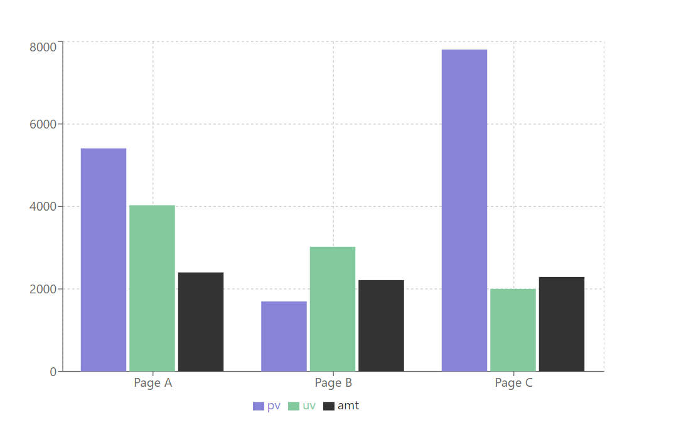
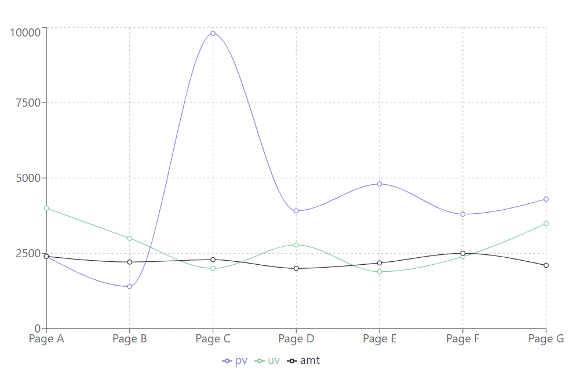
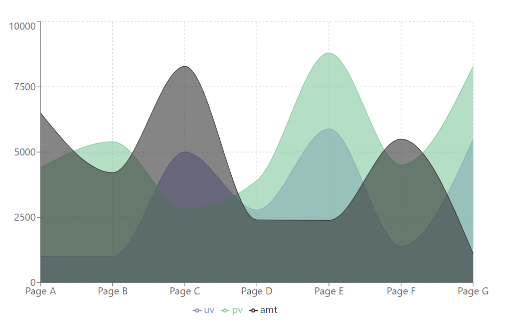

# Bibliotecas de gráficos para React

# recharts

### Instalação:

```
npm i recharts
```

### Modo de utilização:

### 1 - Importação básica

```
import { ExampleChart, Example, XAxis, YAxis, CartesianGrid, Tooltip, Legend, ResponsiveContainer } from 'recharts';
```

ResponsiveContainer: Container que englobará o gráfico;

XAxis: Eixo X;

YAxis: Eixo Y;

ExampleChart: Tipo do gráfico;

Example: Objeto do gráfico;

Tooltip: Container que aparecerá no hover (informações de onde o mouse estiver em cima) do gráfico;

Legend: Legenda com a simbologia da informação do gráfico;

CartesianGrid: Grade cartesinada para melhor visualização.

### 2 - Exemplo de dados

```
const data = [
  {
    name: 'Page A',
    uv: 4030,
    pv: 5409,
    amt: 2400,
  },
  {
    name: 'Page B',
    uv: 3021,
    pv: 1698,
    amt: 2214,
  },
  {
    name: 'Page C',
    uv: 2000,
    pv: 7805,
    amt: 2290,
  }
];
```

### 3 - Montagem do componente

```
<ResponsiveContainer
  width='100%'          // estilos
  height='100%'
  minWidth='50em'
  minHeight='30em'
  >
    <ExampleChart
      width={500}
      height={300}
      data={data}       // dados
      margin={{
        top: 5,
        right: 30,
        left: 20,
      }}
    >
      <CartesianGrid strokeDasharray='3 3' />
      <XAxis dataKey='name' />    // nome eixo X
      <YAxis />
      <Tooltip />
      <Legend />
      <Example
        dataKey='pv'
        fill='#8884d8'
      />
      <Example
        dataKey='uv'
        fill='#82ca9d'
      />
      <Example
        dataKey='amt'
        fill='#333'
      />
    </ExampleChart>
</ResponsiveContainer>
```

### 4 - Escolher o tipo de gráfico

[Exemplos de tipos de gráfico disponíveis](https://recharts.org/en-US/examples)

Utilizando um gráfico de `barras`, com os dados do passo 2 e o esqueleto do passo 3, temos o seguinte componente:

```
<ResponsiveContainer
  width='100%'
  height='100%'
  minWidth='50em'
  minHeight='30em'
  >
    <BarChart
      width={500}
      height={300}
      data={data}
      margin={{
        top: 5,
        right: 30,
        left: 20,
      }}
    >
      <CartesianGrid strokeDasharray='3 3' />
      <XAxis dataKey='name' />
      <YAxis />
      <Tooltip />
      <Legend />
      <Bar
        dataKey='pv'
        fill='#8884d8'
      />
      <Bar
        dataKey='uv'
        fill='#82ca9d'
      />
      <Bar
        dataKey='amt'
        fill='#333'
      />
    </BarChart>
</ResponsiveContainer>
```

Que resultará neste gráfico:




## Outros exemplos de gráficos, com dados diferentes



